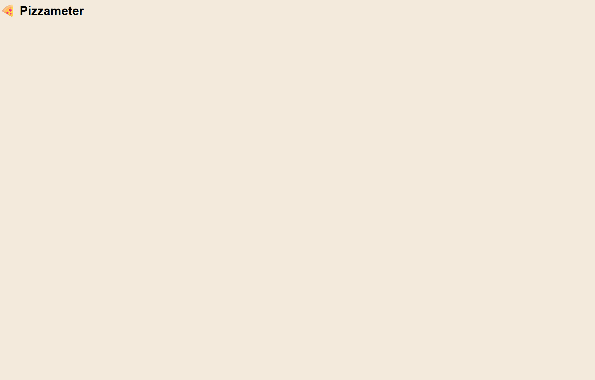

# 🍕 Pizzameter

The website uses various factors to calculate the optimal number of pizzas for a group.  
In addition to the calculation, the website provides statistics, tips, and predictions,  
so that your next pizza night won't leave anyone hungry or result in too many leftovers.

## 🛠 Skills

Javascript, HTML, CSS

## 🕑 Current status

## ✔️ ToDo´s

- ~~erstes grobes Grundgerüst erstellen~~
- Header fertigstellen
  > Logo, Name und Slogan nach links
  > rechts Pizzasymbol einfügen
- Footer fertigstellen
- Berechnung der Pizzastücke hinzufügen anhand der Personenanzahl, Hungerlevel und Pizzagröße
- weitere Optionen hinzufügen und für die Berechnung berücksichtigen
  > Vegan, Vegetarisch, kinder dabei, kein Schwein
- Pizza-Analyse hinzufügen
  > Wahrscheinlichkeit für resthunger, Sättigungslevel, Streitpotential
- Fehlermeldung bei ungültiger Eingabe
  > Fehlende Eingabe, Anzahl im dreistelligen Bereich (Nochmal fragen ob das so gewünscht ist)
- beim Tipp immer wechselne Tipps anzeigen lassen
  > zum Beispiel 7 Tipps, die täglich wechseln
  > z. B wie man eine Pizza am nächsten Tag perfekt erwärmt
- Icon im Tab anzeigen
- Aussehen der Seite verschönern
- Tests hinzufügen
- Dokumentation schreiben

## 📃 License

[MIT](https://choosealicense.com/licenses/mit/)
